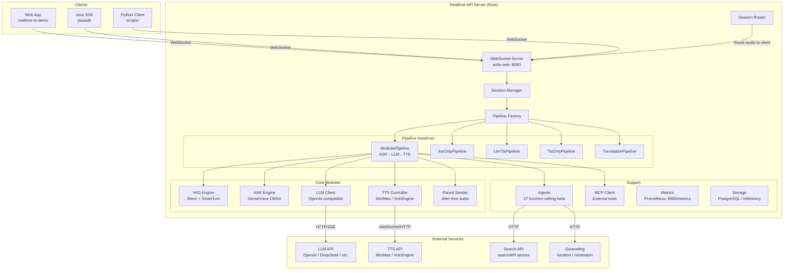
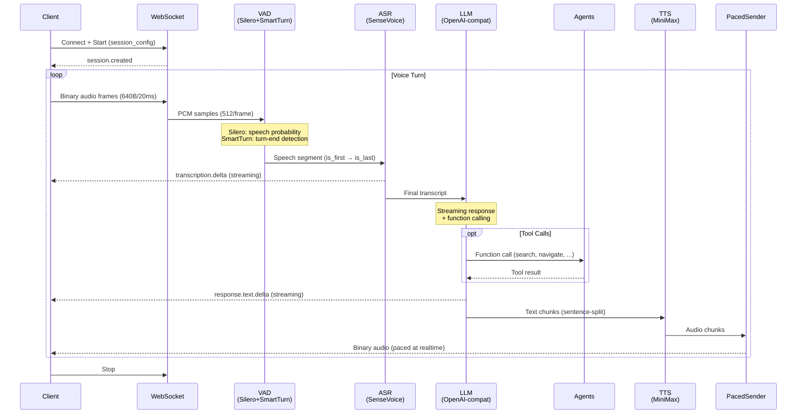
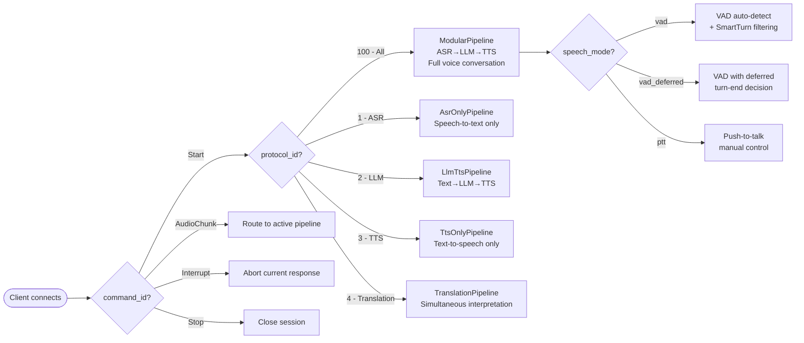
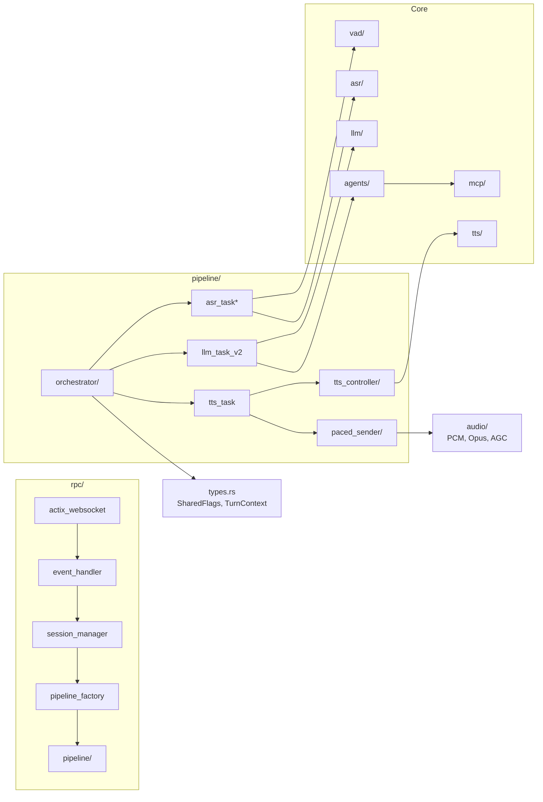

# Architecture Overview

## System Architecture

## Data Flow (protocol_id=100)

The primary pipeline for voice conversations: audio in → intelligence → audio out.

## Pipeline Selection

## Module Dependency Map

## Key Design Decisions

| Decision | Rationale |
|----------|-----------|
| **Silero + SmartTurn two-layer VAD** | Silero alone has false positives on pauses; SmartTurn's semantic model detects actual turn-ends |
| **PacedSender with Welford's variance** | Jitter-free audio delivery; sub-microsecond scheduling overhead |
| **Binary protocol for audio** | 10-30x faster than JSON+Base64; critical for 100+ concurrent sessions |
| **Pipeline factory pattern** | 6 pipeline types share the same WebSocket transport; protocol_id selects behavior |
| **Modular orchestrator** | orchestrator/ split into mod.rs + config.rs + state.rs; each <500 lines |
| **MiMalloc allocator** | Optimized for concurrent small allocations in async Rust |
